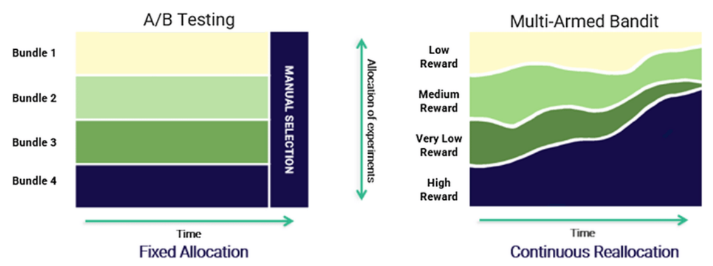
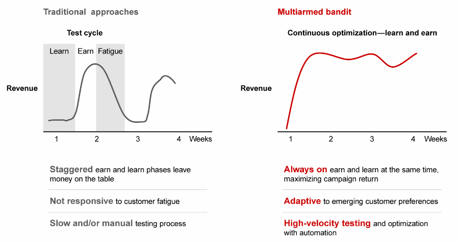

PROJECT: Multi-Armed Bandit algorithm
==============================

Framework for training and visualisation of MAB on synthetic data
# Theoretical framework

## Reinforcement learning

**The exploration-exploitation dilemma** - balancing act between choosing the best option based on current knowledge (which may be incomplete or misleading) or trying new options (that may lead to better future outcomes) at the expense of an exploitation.

### Multiarmed bandits (MAB)

Multi-armed bandits are a class of explore-exploit algorithms that are used to make decisions under uncertainty

### Comparison to classic A/B test

Test faster, smarter, and more efficient.

**Give bot second chance** - they are constantly evolving, the best today isn't necessery the best tomorrow and vice  versa

**Maximize customer satisfaction** - poor performing bots are cut quickly from the traffic
 

### Multi-armed bandit (formulas)

#### notations:
$K$ : Number of arms (actions). \
$t$ : Time step. \
$A_t$ : Action taken at time step $t$. \
$R_t$ : Reward received at time step $t$. \
$Q(a)$ : Estimated value of action $a$. \
$N_t(a)$ : Number of times action $a$ has been chosen up to time $t$.

#### action-value estimation
$$
\begin{align*}
Q_t(a) = \frac{\sum_{i=1}^{t-1} R_i \cdot \mathbb{1}_{A_i=a}}{\sum_{i=1}^{t-1} \mathbb{1}_{A_i=a}}
\end{align*}
$$

#### optimization strategies
##### $\epsilon$-greedy
$$
A_t = 
\begin{cases}
\arg\max_a Q_t(a) & \text{with probability } 1 - \varepsilon \\
\text{random action} & \text{with probability } \varepsilon
\end{cases}
$$

##### Softmax
$$
\begin{align*}
\text{Action probabilities} &= \frac{e^{Q(a) / \tau}}{\sum_{i=1}^{k} e^{Q(i) / \tau}}
\end{align*}
$$
$\tau$ : temperature parameter controlling the level of exploration

##### Upper Confidence Bound (UCB1)
$$
\begin{align*}
A_t &= \text{argmax}_a \left( Q(a) + c \sqrt{\frac{\ln(t)}{N(a)}} \right)
\end{align*}
$$

$c$ : constant controlling the level of exploration \
$N(a)$ : number of times action $a$ has been selected

### Reinforcement learning (formulas)
#### Notations
$s$: State.\
$a$: Action.\
$r$: Reward.\
$\pi(a|s)$: Policy, probability of taking action $a$ in state $s$.\
$V(s)$: Value function for state $s$.\
$Q(s,a)$: Action-value function for state-action pair $(s,a)$.\
$\gamma$: Discount factor.

#### Bellman Expectation Equation for $V(s)$:
$$V(s) = \sum_{a} \pi(a|s) \sum_{s',r} p(s',r|s,a) [r + \gamma V(s')]$$

#### Bellman Expectation Equation for $Q(s,a)$:
$$Q(s,a) = \sum_{s',r} p(s',r|s,a) [r + \gamma \max_{a'} Q(s',a')]$$
  
#### Policy Improvement:
$$\pi'(s) = \arg\max_a Q(s,a)$$

#### Policy Evaluation (Monte Carlo):
$$V(s) \approx \frac{1}{N(s)} \sum_{i=1}^{N(s)} G_i(s)$$

#### Policy Gradient:
$$\nabla_\theta J(\theta) \approx \mathbb{E}_\pi \left[ \nabla_\theta \log \pi(a|s,\theta) Q(s,a) \right]$$

# Project Organization
------------

    ├── LICENSE
    ├── Makefile           <- Makefile with commands like `make data` or `make train`
    ├── README.md          <- The top-level README for developers using this project.
    ├── data
    │   ├── external       <- Data from third party sources.
    │   ├── interim        <- Intermediate data that has been transformed.
    │   ├── processed      <- The final, canonical data sets for modeling.
    │   └── raw            <- The original, immutable data dump.
    │
    ├── docs               <- A default Sphinx project; see sphinx-doc.org for details
    │
    ├── models             <- Trained and serialized models, model predictions, or model summaries
    │
    ├── notebooks          <- Jupyter notebooks. Naming convention is a number (for ordering),
    │                         the creator's initials, and a short `-` delimited description, e.g.
    │                         `1.0-jqp-initial-data-exploration`.
    │
    ├── references         <- Data dictionaries, manuals, and all other explanatory materials.
    │
    ├── reports            <- Generated analysis as HTML, PDF, LaTeX, etc.
    │   └── figures        <- Generated graphics and figures to be used in reporting
    │
    ├── requirements.txt   <- The requirements file for reproducing the analysis environment, e.g.
    │                         generated with `pip freeze > requirements.txt`
    │
    ├── setup.py           <- makes project pip installable (pip install -e .) so src can be imported
    ├── src                <- Source code for use in this project.
    │   ├── __init__.py    <- Makes src a Python module
    │   │
    │   ├── data           <- Scripts to download or generate data
    │   │   └── make_dataset.py
    │   │
    │   ├── features       <- Scripts to turn raw data into features for modeling
    │   │   └── build_features.py
    │   │
    │   ├── models         <- Scripts to train models and then use trained models to make
    │   │   │                 predictions
    │   │   ├── predict_model.py
    │   │   └── train_model.py
    │   │
    │   └── visualization  <- Scripts to create exploratory and results oriented visualizations
    │       └── visualize.py
    │
    └── tox.ini            <- tox file with settings for running tox; see tox.readthedocs.io

--------

Naming of notebooks:

0.01-pjb-data-source-1.ipynb
- 0.01 - Helps leep work in chronological order. The structure is PHASE.NOTEBOOK. NOTEBOOK is just the Nth notebook in that phase to be created. For phases of the project, we generally use a scheme like the following, but you are welcome to design your own conventions:
- 0 - Data exploration - often just for exploratory work
- 1 - Data cleaning and feature creation - often writes data to data/processed or data/interim
- 2 - Visualizations - often writes publication-ready viz to reports
- 3 - Modeling - training machine learning models
- 4 - Publication - Notebooks that get turned directly into reports

<small>Project based on the <a target="_blank" href="https://drivendata.github.io/cookiecutter-data-science/">cookiecutter data science project template</a>. #cookiecutterdatascience</small>
