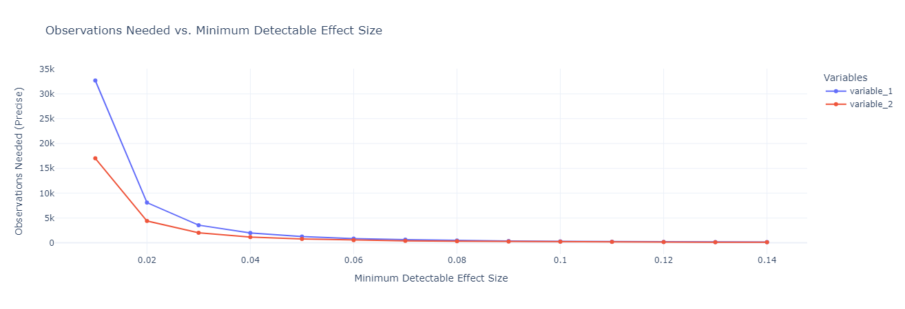

# 1. PROJECT: Multi-Armed Bandit Algorithm

Framework for A/B testing of FragMagenta chatbot versions.

---

## 2. Theoretical Framework
### 2.1 Summary

- A/B testing is a method to improve products.
- The right way to do it: test > evaluate > improve > test.
- There's a danger of false positive results if done incorrectly.
- There are alternatives with better business impact.

### 2.2 A/B Test
#### 2.2.1 What is A/B Testing?

A/B testing, also known as split testing or case-control study, is a method used to compare two or more versions of a product or service to determine which one performs better. In chatbot development, this means comparing different variations of the chatbot's design, content, or functionality to identify the most effective approach.


    example:
    A telecommunication is developing a chatbot to assist customers with troubleshooting internet connection issues. They create two variations of the chatbot: 
    - Version A provides step-by-step instructions for troubleshooting.
    - Version B offers users the option to connect with a live customer support representative.
    Users are randomly assigned to one of the variants. A statistical analysis is performed to determine which variation performs better for a defined business goal.

#### 2.2.2 Why to perform A/B Testing?

In short - to **optimize business metrics**. With A/B testing, one can make more out of existing traffic as even small changes can lead to better user engagement, increased customer satisfaction, and achieving business objectives more effectively.

    Example: 
    The telecommunications company analyzes the results of their A/B test and discovers that Version B of the chatbot, which offers users the option to connect with a live support representative, significantly increases user satisfaction and reduces the time to resolve issues compared to Version A. As a result, they decide to implement Version B as the default option for their chatbot.

#### 2.2.3 Recommended Process 
- Define clear objectives: Increase customer satisfaction and reduce resolution time for internet connection issues.
- Identify variables: Test different approaches for assisting users with troubleshooting.
- Create variations: Develop Version A with step-by-step instructions and Version B with the option to connect with live support.
- Randomize assignment: Randomly assign users to interact with either Version A or Version B of the chatbot.
- Collect data: Monitor user interactions and collect data on user satisfaction and issue resolution time.
- Analyze results: Use statistical analysis to compare the performance of Version A and Version B.
- Implement changes: Based on the analysis, implement the more effective version of the chatbot.


#### 2.2.4 A/B Testing vs. Multivariate Testing
When an object is **modified in more than one way**, we call it Multivariate Testing.


Multivariate testing allows for simultaneous testing of multiple variables and interactions between them, providing insights into the combined effects of different elements on user behavior.

    Example:
    The telecom expands A/B testing to include variations in pricing options, promotional messages, and website layout. They use multivariate testing to analyze the combined impact of these variables on sign-up conversions and user engagement.

##### Caution!

What if we would test many groups, say, 10, and use 5 metrics? Even intuitively, if we will make many attempts to find a difference between groups, finally we would find one with the difference. This phenomenon is also related to <a href="https://en.wikipedia.org/wiki/Data_dredging" target="_blank">p-hacking</a>.

Danger which it brings is known as **spurious correlations**, which could be **nothing but random fluctuations**, e.g.:


See more at <a href="https://www.nationalgeographic.com/science/article/nick-cage-movies-vs-drownings-and-more-strange-but-spurious-correlations" target="_blank">National Geographic</a>.

##### 2.2.5 What are typical metrics?

| Name                | Type        | Scale    | Business Value |
|---------------------|-------------|----------|----------------|
| Rating              | Discrete    | 1-5      | High           |
| NPS                 | Discrete    | 0 to 10  | High           |
| Acceptance percent  | Continious  | 0-1      | High           |
| Fabricating percent | Continious  | 0-1      | High           |
| Incomplete percent  | Continious  | 0-1      | Low            |
| ...                 | ...         | ...      | ...            |

### 2.3 Simple statistics behind
#### 2.3.1 Why can't we just compare two means?

The answer is below. Consider two cases with exactly the same mean values and exactly the same effect size (difference between means).


Even intuitively, one might say that Case I provides somewhat more certainty of a true difference than Case II. Why? Because of the higher variance of Case II. This is related to the minimum detectable effect.

#### 2.3.2 T-test

Tests whether there is a significant difference between the means of groups. The variable must be normally distributed.


- Assumptions: The t-test assumes that the data is normally distributed and that the variances of the two groups being compared are equal. It also assumes that the observations are independent.
- Weaknesses: If the assumptions are violated, the results of the t-test may not be reliable. Additionally, the t-test is sensitive to outliers.

#### 2.3.1 Minimum Detectable Effect (MDE)

Explaining MDE as well as Type I, II errors, α and β values goes beyond the scope. But perhaps the picture below can give some intuition:


Given all the rest equal, the higher would be the variance of the distributions $H_0$ and $H_1$, the bigger would be the area representing the False Positive rate (Type I error). I.e., we would see the difference between A and B groups, which in fact would be nothing more than a coincidence (see *spurious correlations* examples above).

#### 2.3.3 What if assumptions aren't met?

So far, we considered tests which assume a normal distribution of the variable. Real data rarely meet this assumption. 

    example (NPS values):


#### 3.4.1 How to handle it?
##### Bootstrap
In most cases, we may apply the <a href="https://en.wikipedia.org/wiki/Central_limit_theorem" target="_blank">Central Limit Theorem</a>, which states that the distribution of a normalized version of the sample mean converges to a standard normal distribution. This holds even if the original variables themselves are not normally distributed. The method is called <a href="https://en.wikipedia.org/wiki/Bootstrapping_(statistics)" target="_blank">bootstrapping</a>:


##### Wilcoxon rank-sum test (also known as Mann-Whitney U test)

Determines if there is a difference between two samples. Variables do not have to satisfy any distribution.


---
### 3.5 A/B Tests drawback and alternatives

A/B testing is not the only way to test which group is better. Its main advantage is statistical significance. Yet, it comes at the price:

#### 3.5.1 Resource Intensive
A/B testing requires a significant amount of resources, especially when dealing with multiple variations and large sample sizes. Each variation needs to be tested independently, leading to increased time and cost.

    example (anonymized production metrics):
 


#### 3.5.2 Delayed Learning: 
A/B testing relies on fixed sample sizes and requires data to be collected over a specified period before conclusions can be drawn. This can lead to delays in learning which variation performs better, especially if there are rapid changes in user behavior or if the sample size requirement is not met within a reasonable timeframe.

#### 3.5.3 Inflexibility: 
A/B testing typically requires predefining the variations to be tested before the experiment begins. This can be limiting if new variations or changes need to be introduced during the testing process.

#### 3.5.4 External factors: 
Market trends, seasonal variations, and user demographics may influence the outcome of A/B tests, making it challenging to isolate the impact of specific variables.

The alternative methods often used, when it comes to production systems with high load and sensitivity to suboptimal solutions, is Reinforcement learning algorithms.

---

## 5. Reinforcement Learning

### 5.1 The Exploration-Exploitation Dilemma

Balancing act between choosing the best option based on current knowledge or trying new options that may lead to better future outcomes at the expense of exploitation.

#### 5.1.1 Multiarmed Bandits (MAB)

Multi-armed bandits are a class of explore-exploit algorithms used to make decisions under uncertainty.


#### 5.1.2 Comparison to Classic A/B Test

Test faster, smarter, and more efficiently.

**Give bot second chance** - they are constantly evolving; the best today isn't necessarily the best tomorrow and vice versa.

**Maximize customer satisfaction** - poor-performing bots are cut quickly from the traffic.

---

## 6. Notations and Formulas

### 6.1 Markov Decision Process (MDP)

#### 6.1.1 Notations

- $s \in \mathcal{S}$: set of states.
- $a \in \mathcal{A}$: set of actions.
- $r \in \mathcal{R}$: set of rewards.
- $P(s'|s,a)$: probability of transitioning to state $s'$ given state $s$ and action $a$.
- $R(s,a,s')$: reward received after transitioning from state $s$ to state $s'$ by taking action $a$.
- $\gamma$: discount factor.

#### 6.1.2 State Transition Probability (Markov's Property)

$$P(s_{t+1}|s_t, a_t, s_{t-1}, a_{t-1}) = P(s_{t+1}|s_t, a_t)$$

### 6.2 Multi-armed Bandit

#### 6.2.1 Notations

- $K$: Number of arms (actions).
- $t$: Time step.
- $A_t$: Action taken at time step $t$.
- $R_t$: Reward received at time step $t$.
- $Q(a)$: Estimated value of action $a$.
- $N_t(a)$: Number of times action $a$ has been chosen up to time $t$.

#### 6.2.2 Action-Value Estimation

$$Q_t(a) = \frac{\sum_{i=1}^{t-1} R_i \cdot \mathbb{1}_{A_i=a}}{\sum_{i=1}^{t-1} \mathbb{1}_{A_i=a}}$$

#### 6.2.3 Optimization Strategies

##### 6.2.3.1 ε-Greedy

$$
A_t = 
\begin{cases}
\arg\max_a Q_t(a) & \text{with probability } 1 - \varepsilon \\
\text{random action} & \text{with probability } \varepsilon
\end{cases}
$$

##### 6.2.3.2 Softmax

$$
\text{Action probabilities} = \frac{e^{Q(a) / \tau}}{\sum_{i=1}^{k} e^{Q(i) / \tau}}
$$

$\tau$: temperature parameter controlling the level of exploration

##### 6.2.3.3 Upper Confidence Bound (UCB1)

$$
A_t = \text{argmax}_a \left( Q(a) + c \sqrt{\frac{\ln(t)}{N(a)}} \right)
$$

$c$: constant controlling the level of exploration
$N(a)$: number of times action $a$ has been selected

---

## 7. Project Organization
```
    ├── LICENSE
    ├── Makefile
    ├── README.md
    ├── data
    │   ├── external
    │   ├── interim
    │   ├── processed
    │   └── raw
    │
    ├── docs
    │
    ├── models
    │
    ├── notebooks
    │
    ├── references
    │
    ├── reports
    │   └── figures
    │
    ├── requirements.txt
    │
    ├── setup.py
    │
    └── src
        ├── __init__.py
        ├── data
        │   └── make_dataset.py
        ├── features
        │   └── build_features.py
        ├── models
        │   ├── predict_model.py
        │   └── train_model.py
        └── visualization
            └── visualize.py
```

## 8. References

- [National Geographic](https://www.nationalgeographic.com/science/article/nick-cage-movies-vs-drownings-and-more-strange-but-spurious-correlations)
- [Bootstrap Method](https://en.wikipedia.org/wiki/Bootstrapping_(statistics))
- [Central Limit Theorem](https://en.wikipedia.org/wiki/Central_limit_theorem)
- [p-hacking](https://en.wikipedia.org/wiki/Data_dredging)
