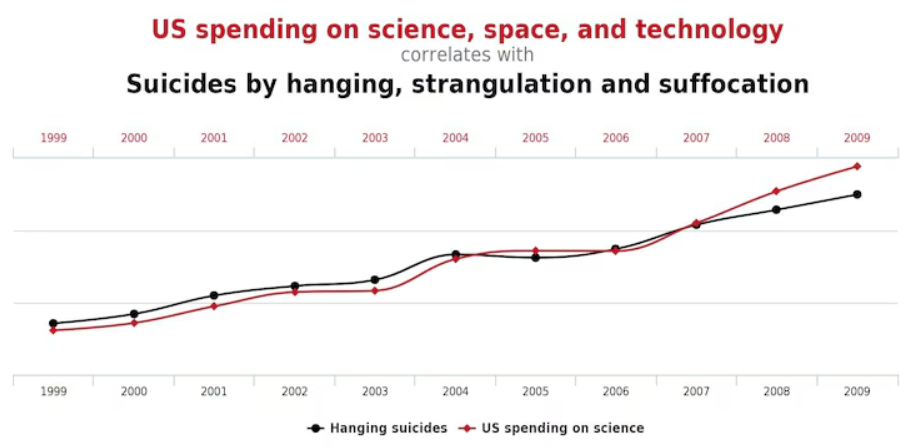
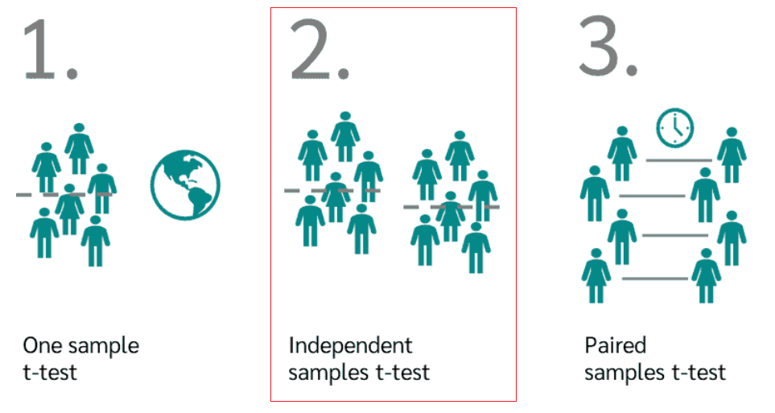
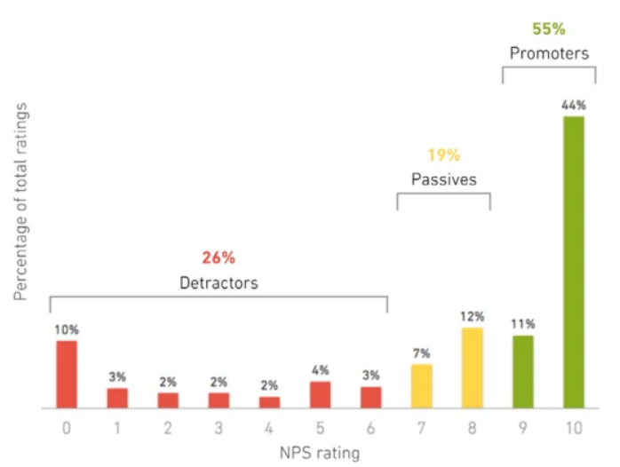

# 1. PROJECT: Multi-Armed Bandit Algorithm

Framework for A/B testing of FragMagenta chatbot versions.

---

## 2. Theoretical Framework

# A/B Testing in Chatbot Development

## 1) What is A/B Testing?
A/B testing, also known as split testing, is a method used to compare two or more versions of a product or service to determine which one performs better. In chatbot development, this means comparing different variations of the chatbot's design, content, or functionality to identify the most effective approach.


### example: 
Suppose a telecommunications company is developing a chatbot to assist customers with troubleshooting internet connection issues. They create two variations of the chatbot: 
- Version A provides step-by-step instructions for troubleshooting.
- Version B offers users the option to connect with a live customer support representative.

### explanation: 
A/B testing uses statistical analysis to determine whether there is a significant difference in performance between the variations. It typically involves calculating metrics such as conversion rates, click-through rates, or completion rates and using hypothesis testing techniques to assess the statistical significance of the differences observed.

### intuition: 
Think of A/B testing like taste testing different flavors of ice cream. You give one group of people vanilla ice cream and another group chocolate ice cream. Then, you measure which flavor gets eaten more. A/B testing works similarly, but instead of ice cream, we're testing different versions of the chatbot to see which one users prefer.

## 2) Where is it Used?
A/B testing is used across various industries, including telecommunications, to optimize user experience and achieve business goals. In the telecommunications industry, A/B testing can be applied to improve customer support services, enhance website navigation, or increase conversion rates for subscription plans.

### Example (Telecom Industry): 
A telecom company wants to increase the number of customers signing up for their fiber optic internet service. They conduct A/B testing on their website's sign-up process, testing different variations of the sign-up form, pricing options, and promotional messages to identify the most effective combination for encouraging conversions.

## 3) Why to Do It?
A/B testing in chatbot development allows businesses to make data-driven decisions and continuously improve the performance of their chatbots. By testing different variations and analyzing user interactions, companies can optimize user engagement, increase customer satisfaction, and achieve their business objectives more effectively.

### Example (Chatbot): 
The telecommunications company analyzes the results of their A/B test and discovers that Version B of the chatbot, which offers users the option to connect with a live support representative, significantly increases user satisfaction and reduces the time to resolve issues compared to Version A. As a result, they decide to implement Version B as the default option for their chatbot.

## 4) Recommended Approach
The recommended approach to A/B testing in chatbot development involves several steps to ensure accurate results and meaningful insights.

### Example (Chatbot): 
The telecom company follows these steps:
- Define clear objectives: Increase customer satisfaction and reduce resolution time for internet connection issues.
- Identify variables: Test different approaches for assisting users with troubleshooting.
- Create variations: Develop Version A with step-by-step instructions and Version B with the option to connect with live support.
- Randomize assignment: Randomly assign users to interact with either Version A or Version B of the chatbot.
- Collect data: Monitor user interactions and collect data on user satisfaction and issue resolution time.
- Analyze results: Use statistical analysis to compare the performance of Version A and Version B.
- Implement changes: Based on the analysis, implement the more effective version of the chatbot.

## 5) Handling Many Groups
In scenarios where there are multiple groups or variations to test, a multivariate testing approach may be more suitable. Multivariate testing allows for simultaneous testing of multiple variables and interactions between them, providing insights into the combined effects of different elements on user behavior.

### Example (Telecom Industry): 
The telecom company expands their A/B testing to include variations in pricing options, promotional messages, and website layout. They use multivariate testing to analyze the combined impact of these variables on sign-up conversions and user engagement.

## 6) Drawbacks and Obstacles
While A/B testing offers valuable insights for optimizing chatbot performance, it may encounter several drawbacks and obstacles in a business setting.

### Example (Chatbot): 
The telecom company faces challenges such as:
- Limited sample size: Difficulty in obtaining a sufficient number of users to achieve statistically significant results.
- Time and resources: A/B testing requires investment in time, resources, and technical expertise to design experiments and analyze results effectively.
- External factors: Market trends, seasonal variations, and user demographics may influence the outcome of A/B tests, making it challenging to isolate the impact of specific variables.
- Ethical considerations: Concerns about user privacy and consent when conducting experiments on user interactions without explicit permission.

Overall, while A/B testing provides valuable insights for optimizing chatbot performance, it is essential to address these challenges and limitations to ensure accurate results and ethical practices.


##### 2.2.4.1 Caution!

As the saying goes: "There are degrees of lies - lies, terrible lies, and statistics." This is because statistics provides enough ways of fooling yourself. Most often unintentionally.

E.g., what if we would test many groups, say, 10, and use 5 metrics? Danger which it brings is known as **spurious correlations**, which could be **nothing but random fluctuations**, e.g.:

 

See more at <a href="https://www.nationalgeographic.com/science/article/nick-cage-movies-vs-drownings-and-more-strange-but-spurious-correlations" target="_blank">National Geographic</a>.

Even intuitively, if we will make many attempts to find a difference between groups, finally we would find one with the difference. This phenomenon is also related to <a href="https://en.wikipedia.org/wiki/Data_dredging" target="_blank">p-hacking</a>.

##### 2.2.4.2 So What to Do?

"Simply" calculate how much data is needed. If the number is too big, reduce the number of groups and/or metrics to fulfill the requirement.

### 2.3 When A/B Testing is Not Suitable?

With A/B testing, we may find ourselves **chasing "local maxima"**, the best outcome but within narrow constraints.


There are situations when we need to think outside the box. A/B testing is not the way to do it. If the user base is not large, achieving statistical significance can be challenging.

---

## 3. Statistical Methods

### 3.1 t-test

Tests whether there is a significant difference between the means of groups. The variable must be normally distributed.



#### 3.1.1 Why Can't We Just Compare Two Means?

The answer is below. Consider two cases with exactly the same mean values and exactly the same effect size (difference between means).


Even intuitively, one might say that Case I provides somewhat more certainty of a true difference than Case II. Why? Because of the higher variance of Case II. This is related to the minimum detectable effect.

### 3.2 Minimum Detectable Effect (MDE)

Explaining MDE as well as Type I, II errors, α and β values goes beyond the scope of README file. But perhaps the picture below can give some intuition:


Given all the rest equal, the higher would be the variance of the distributions $H_0$ and $H_1$, the bigger would be the area representing the False Positive rate (Type I error). I.e., we would see the difference between A and B groups, which in fact would be nothing more than a coincidence (see *spurious correlations* examples above).

### 3.3 What If Data Aren't Normal?

So far, we considered tests which assume a normal distribution of the variable. Real data rarely meet this assumption. How to handle it?

Luckily, in most cases, we may apply the <a href="https://en.wikipedia.org/wiki/Central_limit_theorem" target="_blank">Central Limit Theorem</a>, which states that the distribution of a normalized version of the sample mean converges to a standard normal distribution. This holds even if the original variables themselves are not normally distributed. The method is called <a href="https://en.wikipedia.org/wiki/Bootstrapping_(statistics)" target="_blank">bootstrapping</a>:


### 3.4 u-test

Determines if there is a difference between two samples. Variables do not have to satisfy any distribution.


A typical example of such data is NPS values:



### 3.5 Alternatives to A/B Tests

A/B testing is not the only way to test which group is better. Its main advantage is statistical significance. Yet, it comes at the price of lost opportunities and slower convergence. The alternative methods often used, when it comes to production systems with high load and sensitivity to suboptimal solutions, is Reinforcement learning algorithms.

---

## 4. Metrics

| Name              | Type        | Scale                | Business Value | FM+ | FMc | FMcalm | Cons   |
|-------------------|-------------|----------------------|----------------|-----|-----|--------|--------|
| Rating            | Measurement | 1-5                  | High           | Yes | Yes |        |        |
| Helped            | Binary      | 0-1                  | Medium         | Yes | Yes |        |        |
| NPS               | Measurement | 0 to 10              | High           | Yes | Yes |        |        |
| Acceptable        | Binary      | 0-1                  | High           |     |     | Yes    |        |
| Acceptable Answer | Categorical | ok, good, bad, risky | Medium         |     |     | Yes    |        |
| Fabricating       | Binary      | 0-1                  | High           |     |     | Yes    |        |
| Incomplete Answer | Binary      | 0-1                  | Low            |     |     | Yes    |        |

---

## 5. Reinforcement Learning

### 5.1 The Exploration-Exploitation Dilemma

Balancing act between choosing the best option based on current knowledge or trying new options that may lead to better future outcomes at the expense of exploitation.

#### 5.1.1 Multiarmed Bandits (MAB)

Multi-armed bandits are a class of explore-exploit algorithms used to make decisions under uncertainty.


#### 5.1.2 Comparison to Classic A/B Test

Test faster, smarter, and more efficiently.

**Give bot second chance** - they are constantly evolving; the best today isn't necessarily the best tomorrow and vice versa.

**Maximize customer satisfaction** - poor-performing bots are cut quickly from the traffic.

---

## 6. Notations and Formulas

### 6.1 Markov Decision Process (MDP)

#### 6.1.1 Notations

- $s \in \mathcal{S}$: set of states.
- $a \in \mathcal{A}$: set of actions.
- $r \in \mathcal{R}$: set of rewards.
- $P(s'|s,a)$: probability of transitioning to state $s'$ given state $s$ and action $a$.
- $R(s,a,s')$: reward received after transitioning from state $s$ to state $s'$ by taking action $a$.
- $\gamma$: discount factor.

#### 6.1.2 State Transition Probability (Markov's Property)

$$P(s_{t+1}|s_t, a_t, s_{t-1}, a_{t-1}) = P(s_{t+1}|s_t, a_t)$$

### 6.2 Multi-armed Bandit

#### 6.2.1 Notations

- $K$: Number of arms (actions).
- $t$: Time step.
- $A_t$: Action taken at time step $t$.
- $R_t$: Reward received at time step $t$.
- $Q(a)$: Estimated value of action $a$.
- $N_t(a)$: Number of times action $a$ has been chosen up to time $t$.

#### 6.2.2 Action-Value Estimation

$$Q_t(a) = \frac{\sum_{i=1}^{t-1} R_i \cdot \mathbb{1}_{A_i=a}}{\sum_{i=1}^{t-1} \mathbb{1}_{A_i=a}}$$

#### 6.2.3 Optimization Strategies

##### 6.2.3.1 ε-Greedy

$$
A_t = 
\begin{cases}
\arg\max_a Q_t(a) & \text{with probability } 1 - \varepsilon \\
\text{random action} & \text{with probability } \varepsilon
\end{cases}
$$

##### 6.2.3.2 Softmax

$$
\text{Action probabilities} = \frac{e^{Q(a) / \tau}}{\sum_{i=1}^{k} e^{Q(i) / \tau}}
$$

$\tau$: temperature parameter controlling the level of exploration

##### 6.2.3.3 Upper Confidence Bound (UCB1)

$$
A_t = \text{argmax}_a \left( Q(a) + c \sqrt{\frac{\ln(t)}{N(a)}} \right)
$$

$c$: constant controlling the level of exploration
$N(a)$: number of times action $a$ has been selected

---

## 7. Project Organization
```
    ├── LICENSE
    ├── Makefile
    ├── README.md
    ├── data
    │   ├── external
    │   ├── interim
    │   ├── processed
    │   └── raw
    │
    ├── docs
    │
    ├── models
    │
    ├── notebooks
    │
    ├── references
    │
    ├── reports
    │   └── figures
    │
    ├── requirements.txt
    │
    ├── setup.py
    │
    └── src
        ├── __init__.py
        ├── data
        │   └── make_dataset.py
        ├── features
        │   └── build_features.py
        ├── models
        │   ├── predict_model.py
        │   └── train_model.py
        └── visualization
            └── visualize.py
```

## 8. References

- [National Geographic](https://www.nationalgeographic.com/science/article/nick-cage-movies-vs-drownings-and-more-strange-but-spurious-correlations)
- [Bootstrap Method](https://en.wikipedia.org/wiki/Bootstrapping_(statistics))
- [Central Limit Theorem](https://en.wikipedia.org/wiki/Central_limit_theorem)
- [p-hacking](https://en.wikipedia.org/wiki/Data_dredging)
